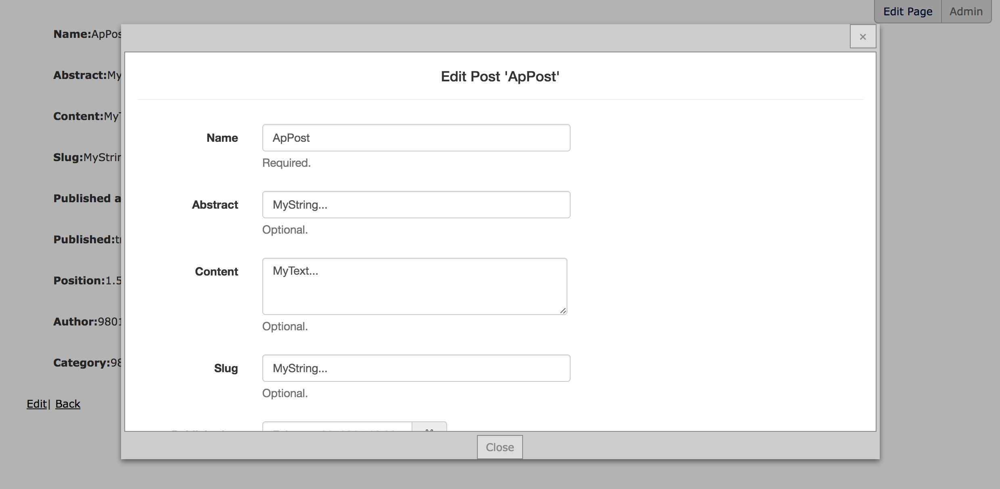

# RailsAdminLiveEdit 

A [rails_admin](https://github.com/sferik/rails_admin) plugin to edit site contents from the frontend.

If the user is logged in in rails_admin and is viewing an editable page an edit button is shown on the top right which allow to open a modal window to edit the page content.

## Installation

- Add to Gemfile: `gem 'rails_admin_live_edit'`

- Add to application layout (in body) (erb example): `<%= render 'live_edit/ra_live_editor' %>`

- Add to *app/assets/javascripts/application.js*: `//= require rmodal.js/dist/rmodal`

- Edit or create *app/assets/javascripts/rails_admin/custom/ui.js* and add: `//= require rails_admin/plugins/live_edit/ui.js`

## Preview

## Contributors

- [Mattia Roccoberton](http://blocknot.es) - creator, maintainer